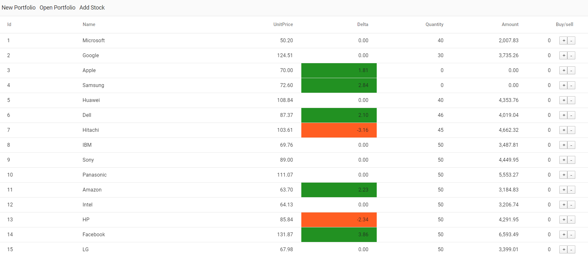
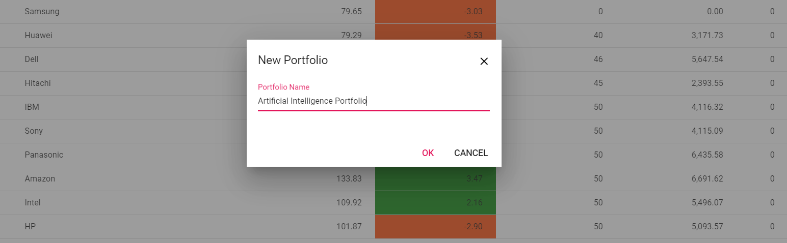
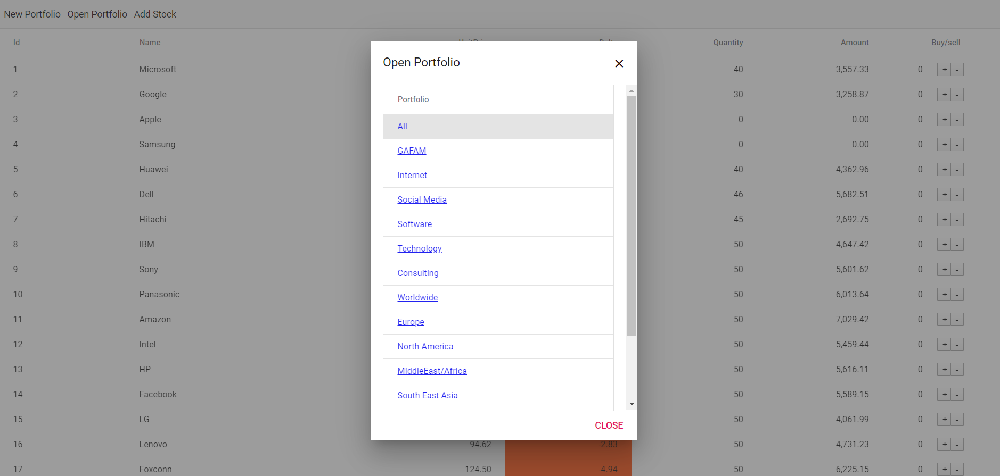
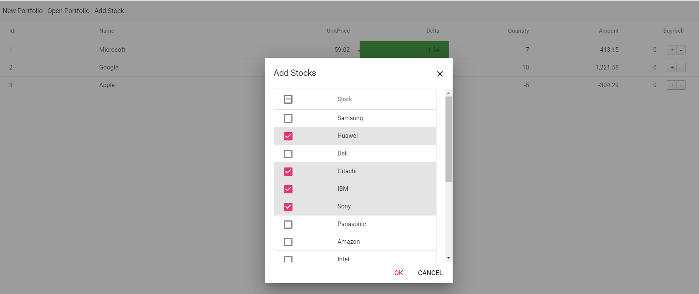

# PortfolioSimulation
Simple example for simulating portfolio/stock trading using ReactJs and SpringBoot

## Portfolio with price updates

## Create new portfolio

## Open an existing portfolio

## Add stocks to the current portfolio

